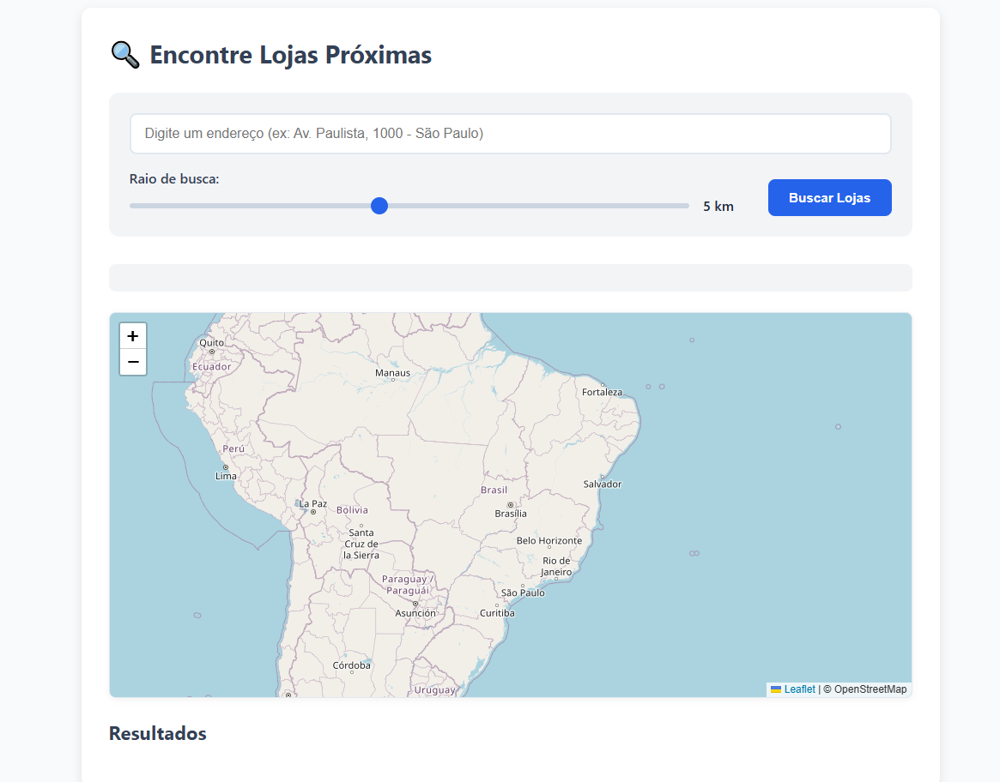

# Localizador de Lojas por Categoria

Um aplicativo web para encontrar estabelecimentos comerciais próximos a um endereço específico, com filtros por categoria e raio de busca personalizável.

Teste aqui [Search Store](https://search-store-two.vercel.app/).



## 📋 Índice

- [Visão Geral](#visão-geral)
- [Funcionalidades](#funcionalidades)
- [Tecnologias Utilizadas](#tecnologias-utilizadas)
- [Estrutura do Projeto](#estrutura-do-projeto)
- [Instalação](#instalação)
- [Como Usar](#como-usar)
- [APIs Utilizadas](#apis-utilizadas)
- [Personalização](#personalização)
- [Limitações Conhecidas](#limitações-conhecidas)
- [Contribuição](#contribuição)
- [Licença](#licença)

## 🔍 Visão Geral

O **Localizador de Lojas por Categoria** é uma aplicação web que permite aos usuários encontrar estabelecimentos comerciais (lojas, restaurantes, serviços, etc.) próximos a um endereço específico. O sistema utiliza dados do OpenStreetMap e oferece uma interface intuitiva para visualização e filtragem dos resultados.

## ✨ Funcionalidades

- **Busca por endereço**: Encontre estabelecimentos próximos a qualquer endereço.
- **Raio de busca personalizável**: Defina a área de busca de 1 a 10 km.
- **Filtros por categoria**: Visualize apenas as lojas de categorias específicas.
- **Mapa interativo**: Visualize as lojas no mapa com marcadores personalizados.
- **Visualização em lista**: Veja detalhes das lojas em cards organizados.
- **Interação mapa-lista**: Destaque no mapa ao passar o mouse sobre uma loja na lista.
- **Redirecionamento para Google Maps**: Abra a localização no Google Maps com um clique.
- **Interface responsiva**: Funciona em dispositivos desktop e móveis.

## 🛠️ Tecnologias Utilizadas

- **HTML5**: Estruturação da página
- **CSS3**: Estilização e responsividade
- **JavaScript**: Lógica e interatividade
- **Leaflet.js**: Biblioteca para mapas interativos
- **OpenStreetMap**: Dados cartográficos
- **Nominatim API**: Geocodificação de endereços
- **Overpass API**: Consulta de dados do OpenStreetMap

## 📁 Estrutura do Projeto

```
Search-Store/
│
├── index.html         # Estrutura da página
├── styles.css         # Estilos e layout
├── script.js          # Lógica de funcionamento
└── README.md          # Documentação do projeto
```

### Detalhamento dos Arquivos

- **index.html**: Contém a estrutura base da aplicação e os elementos de interface.
- **styles.css**: Define toda a aparência visual e comportamento responsivo.
- **script.js**: Implementa a lógica de busca, filtragem e exibição de resultados.

## 🚀 Instalação

1. Clone este repositório ou baixe os arquivos:

   ```bash
   git clone https://github.com/Numbzin/Search-Store.git
   ```

2. Não são necessárias dependências adicionais para rodar o projeto localmente.

3. Abra o arquivo `index.html` em um navegador web moderno.

> **Nota**: Para um ambiente de produção, recomenda-se hospedar os arquivos em um servidor web.

## 📝 Como Usar

1. **Digite um endereço** na caixa de pesquisa (quanto mais específico, melhor).
2. **Ajuste o raio de busca** usando o controle deslizante (1 a 10 km).
3. **Clique em "Buscar Lojas"** ou pressione Enter.
4. **Visualize os resultados** no mapa e na lista abaixo.
5. **Filtre por categoria** clicando nos botões de categoria.
6. **Clique em uma loja** para abrir sua localização no Google Maps.
7. **Passe o mouse sobre uma loja** na lista para destacá-la no mapa.

## 🌐 APIs Utilizadas

### Nominatim API

- **Finalidade**: Conversão de endereços em coordenadas geográficas (geocodificação).
- **Endpoint**: `https://nominatim.openstreetmap.org/search`
- **Limitações**: Máximo de 1 requisição por segundo.

### Overpass API

- **Finalidade**: Consulta de dados específicos do OpenStreetMap.
- **Endpoint**: `https://overpass-api.de/api/interpreter`
- **Limitações**: Evite consultas muito grandes ou frequentes.

## 🎨 Personalização

### Cores e Tema

As cores principais podem ser facilmente alteradas no início do arquivo CSS através das variáveis CSS (`:root`):

```css
:root {
  --primary-color: #2563eb;
  --primary-dark: #1d4ed8;
  /* outras variáveis de cor */
}
```

### Raio de Busca

O limite do raio de busca pode ser ajustado alterando os atributos do input range no HTML:

```html
<input type="range" id="search-radius" min="1" max="10" value="5" step="0.5" />
```

### Categorias

O sistema traduz automaticamente as categorias do OpenStreetMap. Para adicionar ou modificar traduções, edite o dicionário `translations` na função `formatCategoryName()` no arquivo JavaScript.

## ⚠️ Limitações Conhecidas

- **Densidade de dados**: A quantidade de lojas encontradas depende da completude dos dados no OpenStreetMap na região pesquisada.
- **Limite de requisições**: As APIs utilizadas possuem limites de requisições. Use com moderação.
- **Precisão de geocodificação**: Endereços muito genéricos podem não ser encontrados ou retornar localizações aproximadas.
- **Categorização**: Algumas lojas podem não ter categorias definidas no OpenStreetMap e aparecerão como "Outros".

## 🤝 Contribuição

Contribuições são bem-vindas! Sinta-se à vontade para:

1. Abrir issues para reportar bugs ou sugerir melhorias
2. Enviar pull requests com correções ou novas funcionalidades
3. Melhorar a documentação

## 📄 Licença

Este projeto está licenciado sob a licença MIT - veja o arquivo [LICENSE] para detalhes.

---

Desenvolvido com 💙 por **NMB & Claude (IA)**
